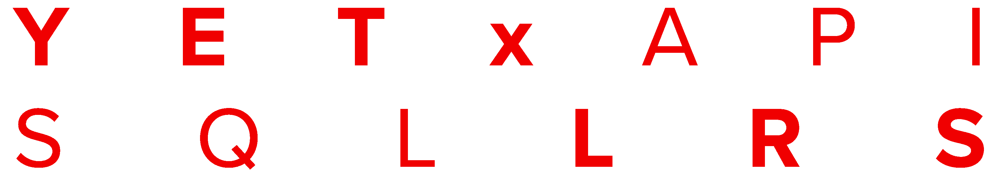

# lrsql

_lrsql (LER-skwəl) - The Learning Record Structured Query Language_

A SQL-based Learning Record Store.

Currently, lrsql is installed by pulling the latest commit from its GitHub repo. In the future it will be available as a closed-source software download available via the purchase of a license.

Note: lrsql is the development name of this project; SQL LRS is what this project is called in external communications.

## Index

- [Overview](doc/overview.md) - What is lrsql?
- [Environment Variables](doc/env_vars.md) - How to configure lrsql?
- [Makefile Targets](doc/makefile.md) - Using the Makefile during development
- [HTTP Endpoints](doc/endpoints.md) - How to use the lrsql API?
- [TLS/HTTPS](doc/https.md) - How to set up a secure connection with lrsql?
