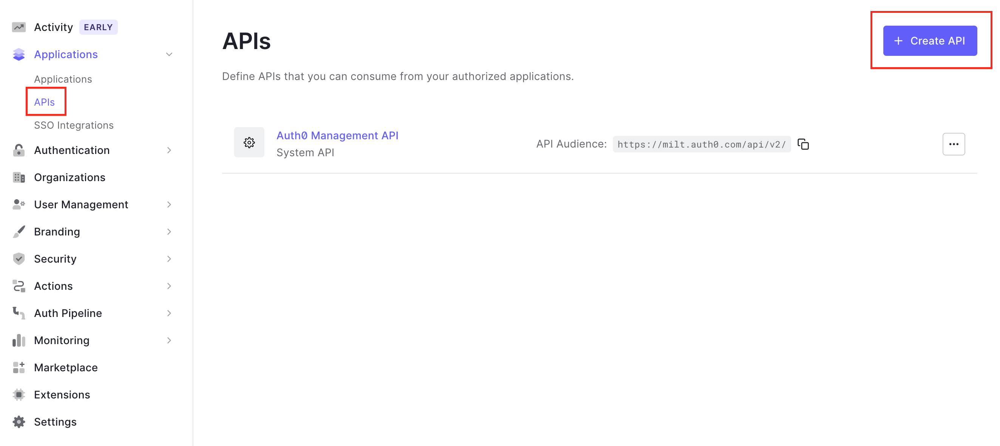
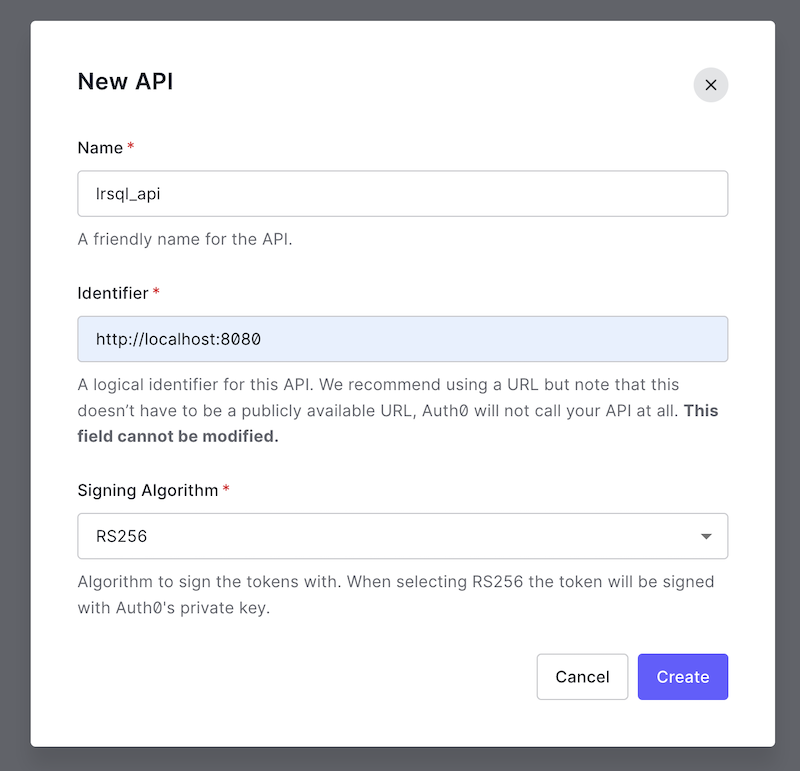
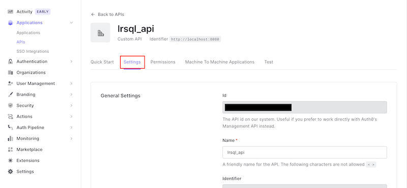
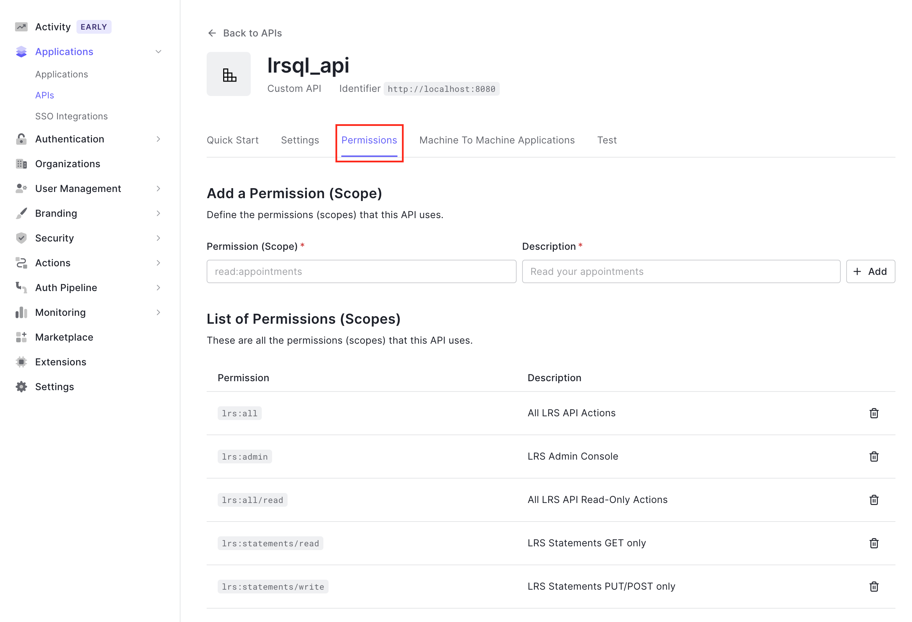

[<- Back to Index](../index.md)

# Auth0 OIDC Setup Guide

This guide provides basic steps to authenticate and authorize SQL LRS (running locally on your machine) against the [Auth0 Cloud Identity Provider](https://auth0.com/). This guide is provided for example purposes only and may not produce an environment suitable for production usage.

### Getting Started

Make an account on [Auth0](https://auth0.com) and log in to the administrative console. Make sure you have tthe [latest release of SQL LRS](https://github.com/yetanalytics/lrsql/releases) downloaded to your machine and unzipped. For this guide you'll need access to a command line and an application for editing JSON files.

### Resource Server (API) Setup

#### Create an API

To enable token authentication to SQL LRS you'll need to configure Auth0 to use it as an OAuth 2.0 Resource Server. To do this, log in to the [Auth0 Dashboard](https://manage.auth0.com/) and navigate to Applications > APIs. Click "+ Create API":

Give your API a descriptive Name like `lrsql_api` and set the API Identifier to `http://localhost:8080` then click "Create":

You will be redirected to the page for the new API.

#### Enable Role-Based Access Control

On your new API's page click the "Settings" tab:

Now you'll need to enable Role-Based Access Control (RBAC). Scroll down to "RBAC Settings". Toggle on the switches for "Enable RBAC" and "Add Permissions in the Access Token" and click "Save":

#### Add Permissions (Scopes)

Scroll back up and click the API "Permissions" tab. Add the following permissions as shown:

[<- Back to Index](../index.md)
