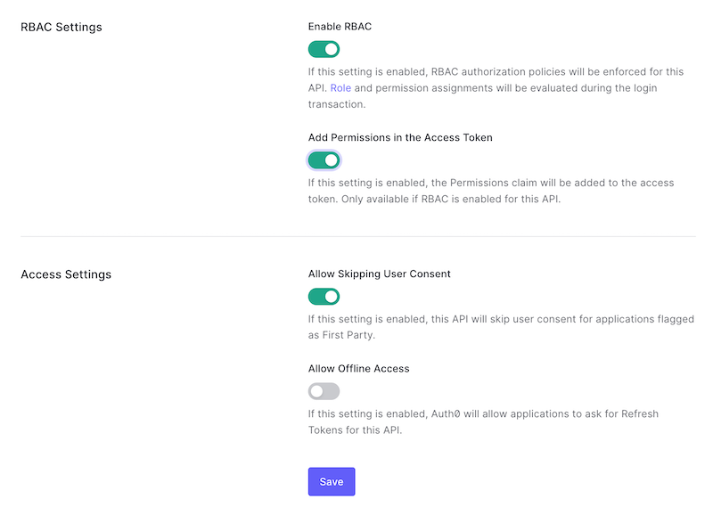
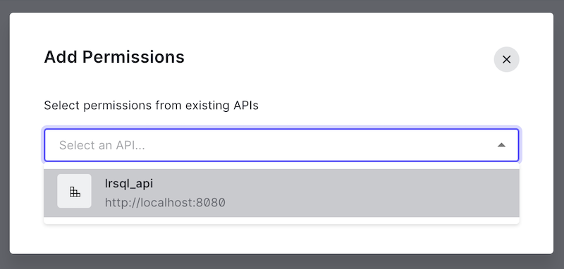
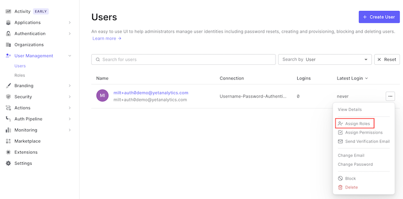
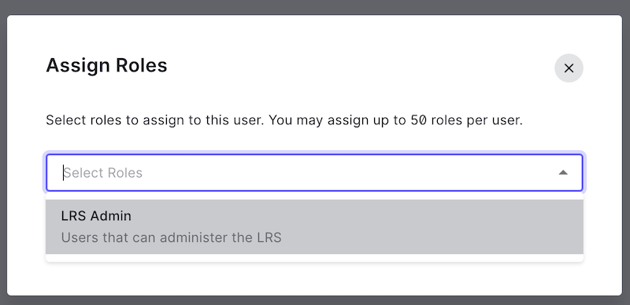
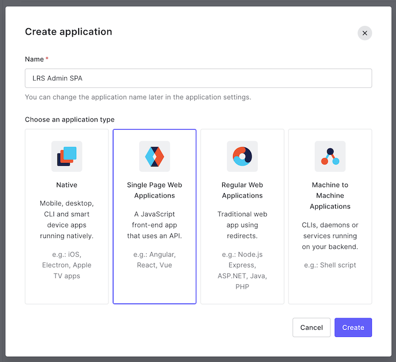
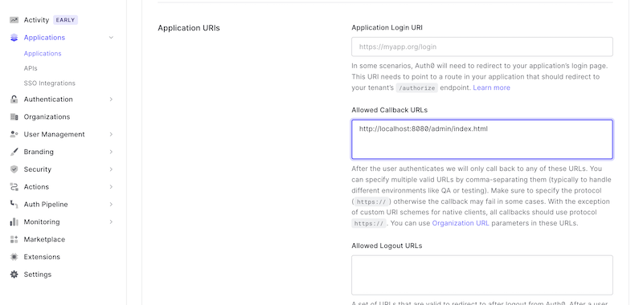
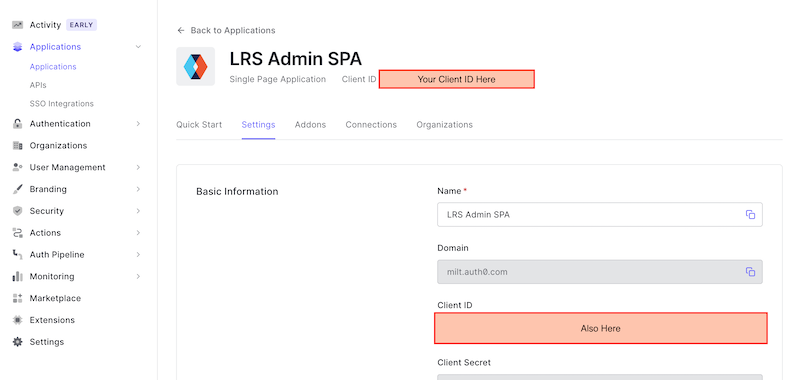
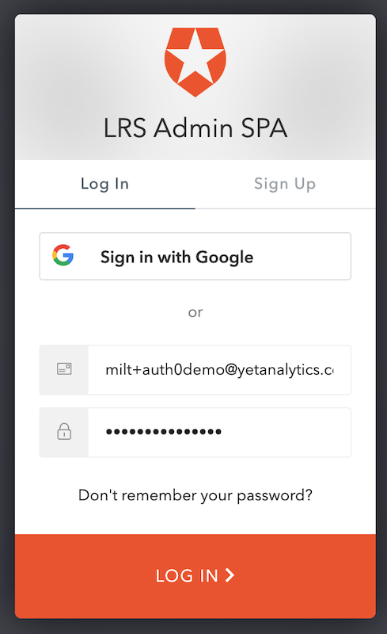

[<- Back to Index](../index.md)

# Auth0 OIDC Setup Guide

This guide provides basic steps to authenticate and authorize SQL LRS (running locally on your machine) against the [Auth0 Cloud Identity Provider](https://auth0.com/). This guide is provided for example purposes only and may not produce an environment suitable for production usage.

### Getting Started

Make an account on [Auth0](https://auth0.com) and log in to the administrative console. Make sure you have tthe [latest release of SQL LRS](https://github.com/yetanalytics/lrsql/releases) downloaded to your machine and unzipped. For this guide you'll need access to a command line and an application for editing JSON files.

### Resource Server (API) Setup

#### Create an API

To enable token authentication to SQL LRS you'll need to configure Auth0 to use it as an OAuth 2.0 Resource Server. To do this, log in to the [Auth0 Dashboard](https://manage.auth0.com/) and navigate to Applications > APIs. Click "+ Create API":


Give your API a descriptive Name like `lrsql_api` and set the API Identifier to `http://localhost:8080` (the origin of the SQL LRS instance we will launch) then click "Create":


You will be redirected to the page for the new API. Note that the API Identifier you enter will be used for the Audience parameter later on.

#### Enable Role-Based Access Control

On your new API's page click the "Settings" tab:


Now you'll need to enable Role-Based Access Control (RBAC). Scroll down to "RBAC Settings". Toggle on the switches for "Enable RBAC" and "Add Permissions in the Access Token" and click "Save":



#### Add Permissions (Scopes)

Scroll back up and click the API "Permissions" tab. Add the following permissions as shown:


### Role Setup

#### Add a Role

Navigate to User Management > Roles:


Click "+ Create Role" and enter a Name and Description, then click "Create":


You will be navigated to the new role's page.

#### Assign Permissions (Scopes)

Click on the "Permissions" tab:


Click "Add Permissions" and select the API you created:



Select the `lrs:all` and `lrs:admin` permissions and click "Add Permissions":


Verify that the role you created now has the proper permissions:


#### Create a User (Optional)

In the next section you'll assign the LRS Admin role you created to a user. If you don't already have a user you'd like to use, navigate to User Management > Users and click "+ Create User":


Enter an email address and password and click "Create":


Verify the user via email before proceeding.

#### Assign the Role to a User

Navigate to User Management > Users and find the user you want to administer SQL LRS. Click the "..." menu button and select "Assign Roles":



Select the LRS Admin role you created and click "Assign":




Your user account is now prepared to administer SQL LRS.

### LRS Admin Application Setup

#### Create an Application

Before you can launch and log in to SQL LRS with Auth0 you'll need to create an "Application" to represent the front end admin SPA. Navigate to Applications > Applications (sic) and click "+ Create Application":


Give it a name, select the application type "Single Page Web Applications" and click "Create":



You will be navigated to the page for the new application.

#### Set a Callback URL

Click the "Settings" tab and scroll down to the "Application URIs" section. In the "Allowed Callback URLs" box enter `http://localhost:8080/admin/index.html`, scroll down and click "Save Changes":



#### Get Client ID

Scroll up to the top of your Application's page and copy down your "Client ID". You'll need this to configure SQL LRS in the next step:



### SQL LRS Setup

#### Configure SQL LRS

In your SQL LRS directory add a file named `lrsql.json` in the `config` subdirectory with the following contents:

``` json
{
  "lrs": {
    "oidcScopePrefix": "lrs:"
  },
  "webserver": {
    "oidcIssuer": "https://<you>.auth0.com/",
    "oidcAudience": "http://localhost:8080",
    "oidcClientId": "<your client id>"
  }
}

```

Replace the hostname in `oidcIssuer` with your auth0 hostname. Replace `oidcClientId` with the Client ID you recorded in the previous section.

#### Run SQL LRS

From the root of the SQL LRS directory run:

``` shell
./bin/run_h2.sh

```

This will launch an in-memory instance of SQL LRS that will not persist any data to disk. If SQL LRS starts successfully you should see something like the following:

``` text
09:02:54.527 [main] INFO  com.zaxxer.hikari.HikariDataSource - HikariPool-1 - Starting...
09:02:54.737 [main] INFO  com.zaxxer.hikari.pool.HikariPool - HikariPool-1 - Added connection conn0: url=jdbc:h2:mem:lrsql.h2 user=
09:02:54.739 [main] INFO  com.zaxxer.hikari.HikariDataSource - HikariPool-1 - Start completed.
09:02:54.740 [main] INFO  lrsql.system.database - Starting new connection for h2:mem database...
09:02:54.807 [main] INFO  lrsql.system.lrs - Starting new LRS
09:02:54.829 [main] WARN  lrsql.util.cert - No cert files found. Creating self-signed cert!
09:02:56.106 [main] INFO  org.eclipse.jetty.util.log - Logging initialized @7146ms to org.eclipse.jetty.util.log.Slf4jLog
09:02:56.323 [main] INFO  org.eclipse.jetty.server.Server - jetty-9.4.48.v20220622; built: 2022-06-21T20:42:25.880Z; git: 6b67c5719d1f4371b33655ff2d047d24e171e49a; jvm 11.0.17+8-LTS
09:02:56.353 [main] INFO  o.e.j.server.handler.ContextHandler - Started o.e.j.s.ServletContextHandler@75ad8ca8{/,null,AVAILABLE}
09:02:56.374 [main] INFO  o.e.jetty.server.AbstractConnector - Started ServerConnector@3e9f3d0f{HTTP/1.1, (http/1.1, h2c)}{0.0.0.0:8080}
09:02:56.378 [main] INFO  o.e.jetty.util.ssl.SslContextFactory - x509=X509@16e693c1(lrsql_keystore,h=[com.yetanalytics.lrsql],a=[],w=[]) for Server@5192abb4[provider=null,keyStore=null,trustStore=null]
09:02:56.412 [main] INFO  o.e.jetty.server.AbstractConnector - Started ServerConnector@3387d45e{SSL, (ssl, alpn, h2, http/1.1)}{0.0.0.0:8443}
09:02:56.413 [main] INFO  org.eclipse.jetty.server.Server - Started @7453ms
09:02:56.413 [main] INFO  lrsql.system.webserver - Starting new webserver at host 0.0.0.0, HTTP port 8080, and SSL port 8443
09:02:56.413 [main] INFO  lrsql.system.webserver -
   __  ______     _   _
|\ \ \ \     |   | | | |     _        _               _       _
| \ \_\ \    |   | |_| |    | |_    / _ \            | |_   _| |_ _
| /   __ \   |    \   / ____| __|  |  _  |  _    ____| | |_| |  _|_|  ___   ___
|/ /\ \ \ \  |     | | | / /| |    | | | |/ _ \ / /_ | |\   /| |  _ / __/  / __|
  /  \ \ \ \ |     | | |  /_| |_   | | | | | | | |_| | | | | | |_| | |___  _| |
 /____\ \_\ \|     |_| |____|\__|  |_| |_|_| |_|\__|_|_| |_|  \__|_|\____/___/
        _______    _______    _            _          _______    _______
       |  _____|  |  ___  |  | |          | |        |  ___  |  |  _____|
       | |_____   | |   | |  | |          | |        | |___| |  | |_____
       |_____  |  | |   | |  | |          | |        |   ____|  |_____  |
        _____| |  | |__ | |  | |_____     | |_____   | |\  \     _____| |
       |_______|  |_____\_\  |_______|    |_______|  |_|  \__\  |_______|
                        (c) 2021-2022 Yet Analytics Inc.

```

#### Log in via Auth0

Navigate to [http://localhost:8080](http://localhost:8080) and click "OIDC LOGIN":


You should see a Login box. Log in with the user to whom you granted the LRS Admin role:



You will be presented with an "Authorize App" box, click the check mark:


If you have completed the above steps correctly, you will be redirected to the SQL LRS Admin console:


If you are not able to log in or receive an error, please let us know in a GitHub issue.

[<- Back to Index](../index.md)
