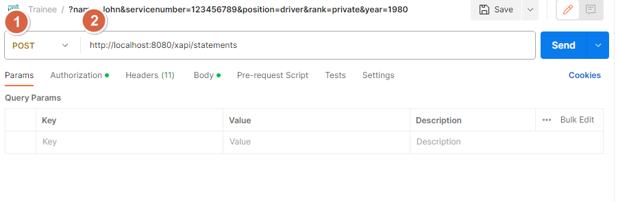
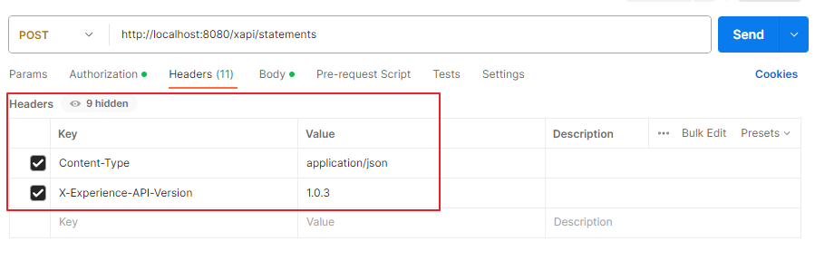
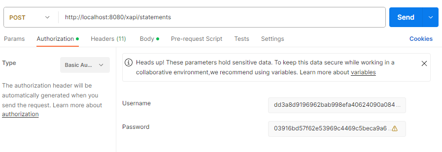
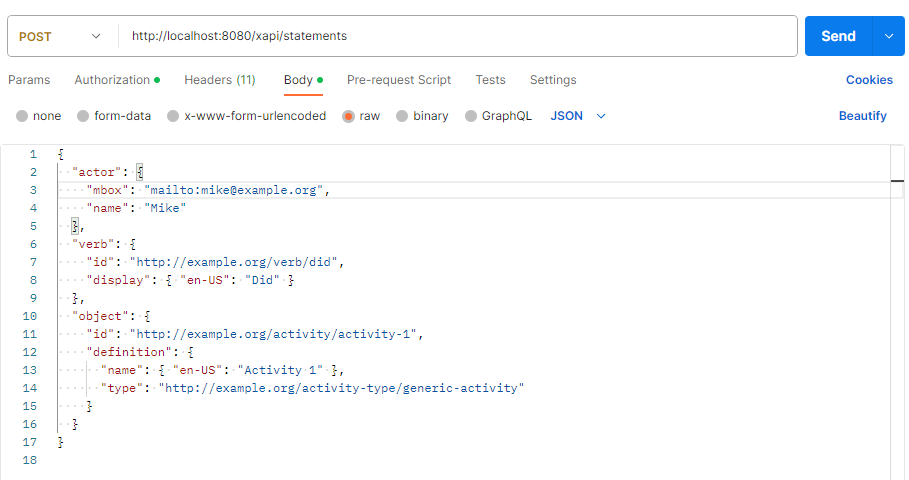

# Postman 

This page describes how to send an xAPI statement through [Postman](https://www.postman.com/), a well-known API platform for building and using APIs.

First, install and run Postman. You may need to sign up if this is your first time running Postman. 

#### 1. Set Request type
Open POSTMAN and create a new request.

1) Set the request type to POST.
2) Enter the URL: http://localhost:8080/xapi/statements.

#### 2. Set Headers

Go to the "Headers" section and add two headers:

|    Key     |       Value    | 
|------------|----------------|
|Content-Type|application/json|
|X-Experience-API-Version|1.0.3|

#### 3. Set Authorization

Go to the "Authorization" section, choose the type "Basic Auth", and enter your credentials:

* Username: my_key (or created key in the **Credential Management** page in the yetXApiSQLRS)
* Password: my_secret (or create secret in the **Credential Management** page in the yetXApiSQLRS)

#### 4. Set Body

Go to the "Body" section, select the "raw" option, and choose the "JSON (application/json)" content type.

Copy and paste your valid JSON xAPI Statement(s) into the body:

Click the "Send" button to make the request.