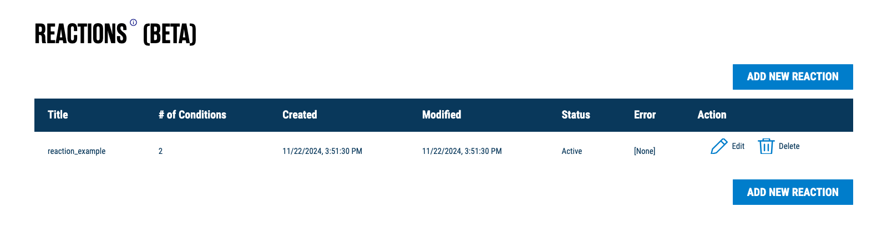
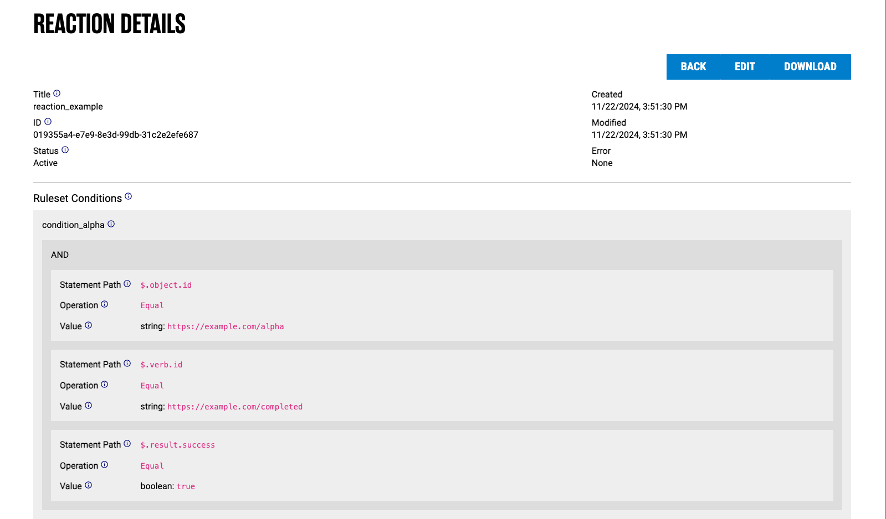
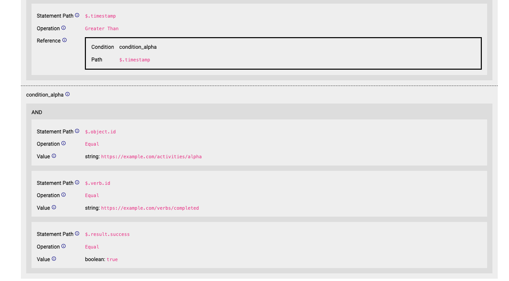
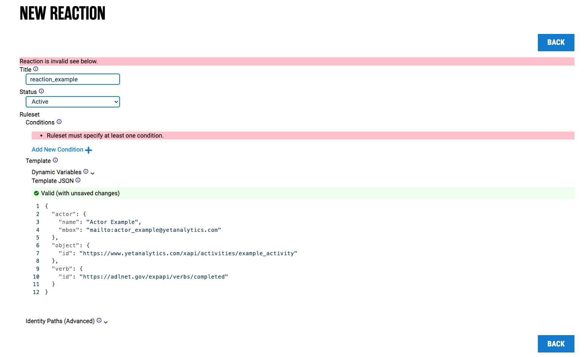
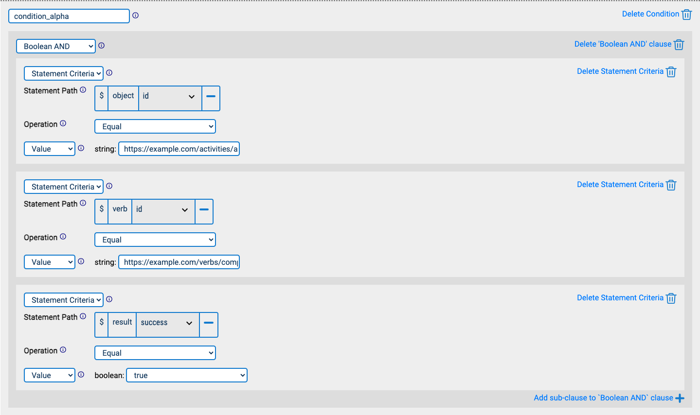
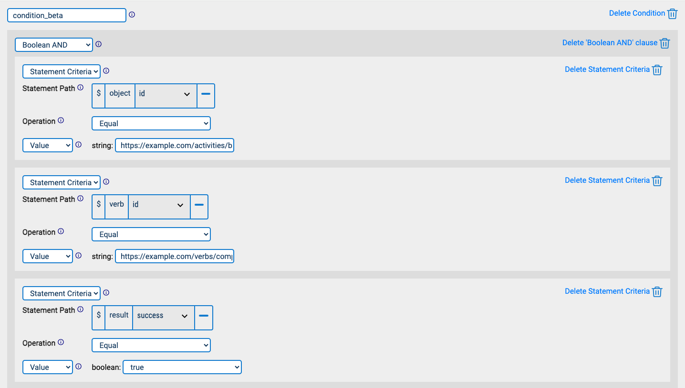
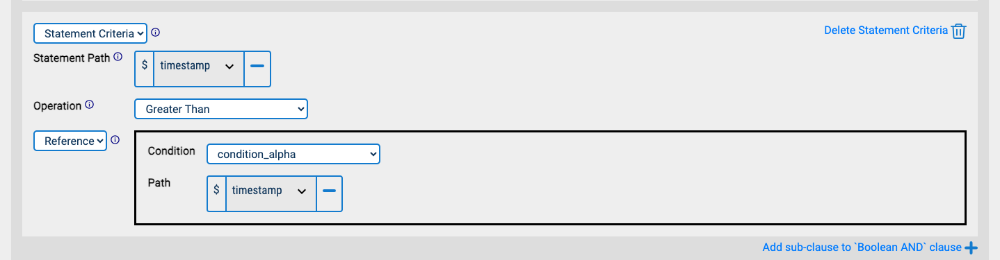
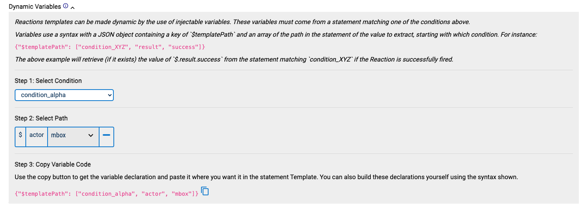
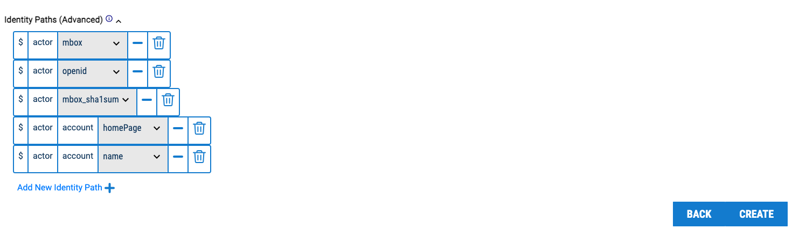

[<- Back to Index](index.md)

# Reactions

Reactions is a new feature that allows SQL LRS to watch for patterns in submitted xAPI data and dynamically generate new statements in response.

## Usage

To use Reactions the `LRSQL_ENABLE_REACTIONS` environment variable or the `enableReactions` LRS configuration property must be set to `true`. Reactions is disabled by default.


To view a reaction, click on the reaction in the table above. This will display a reaction view page.




Each reaction has a title, ID, and created/modified timestamps. It also has an active vs. inactive status; a reaction can either be manually toggled as inactive, or it may be automatically set as inactive if an error is encountered when a reaction is triggered.

The most important part of a reaction is its ruleset. Each ruleset in turn contains the following properties: conditions, template, and identity paths. Each ruleset component is explained in the sections below.

To create a new reaction, click on "Add New Reactions" on the main Reactions page. Likewise, to edit a current reaction, click on "Edit".


Creating a new reaction will display an edit page, where the user can modify the reaction title, active status, and ruleset.

### Conditions

Each condition is a set of rules for finding relevant statements. Each condition has a unique name followed by its rules, which can be composed with boolean logic.


In the example given, statement "alpha" must have `object.id` equal to `https://example.com/activities/alpha` AND `verb.id` equal to `https://example.com/verbs/completed` AND `result.success` property equal to `true`.



Statement "beta" must have the same verb and result success but an object `id` equal to `https://example.com/activities/beta` and a timestamp greater than that of statement "alpha."

#### Rules

All rules have a path array that indicates a path in an xAPI statement and an operator that is one of the following:

* Greater than
* Less than
* Greater than or equal
* Less than or equal
* Equal
* Not equal
* Like (fuzzy match using SQL `%` syntax; for example, `bo%` matches `bob` and `boz`.)
* Array contains

Rules either have a `val` literal value or a `ref` which is a path into a statement found for another condition.

#### Booleans

Booleans compose multiple rules together. Booleans are objects with a single key:

* AND: Array of rules which must all be true
* OR: Array of rules of which one must be true
* NOT: Rule that must _not_ be true

Rule types (either "Statement Criteria" or a boolean) can be selected using the topmost select input, or via the "Add sub-clause" button. Booleans can be nested arbitrarily, e.g. an AND clause can have multiple OR subclauses, which can each have a NOT clause, and so on and so forth.

### Template

The template describes the xAPI statement the reaction will produce. It is identical to an xAPI statement, except that object properties may be substituted with `$templatePath`. This is a path that points to a value in a statement matched by `conditions`, using a JSON array of xAPI statement properties.


To help with creating template paths, the above panel can be opened, which guides the user on how to create paths. In this example, we create a template path to the actor `mbox` for the actor matched by `condition_alpha`.


We can then copy-paste the template path into our statement template.

### Identity Paths

Identity Paths are a method of grouping statements for which you are attempting to match conditions on. Typically, reactions may revolve around actor Inverse Functional Identifiers (IFIs), e.g. actor `mbox` or account `name` strings. Any statements with the same IFI properties will be considered a "group" to match conditions on. This is equivalent to saying "For a given Actor, look for statements that share IFI values."

Alternative approaches to Identity Path may be used by modifying `identityPaths`, for instance using the `registration` context property to group statements by learning session.


In the above example (the default set of identity paths), say we have Statements A and B that share an IFI and match `condition_alpha` and `condition_beta`, respectively. This will trigger the reaction. Conversely, if Statements A and B have _different_ IFIs, then the reaction _will not trigger_.

## Example

Given the reaction specified above, if the following statements are posted to the LRS:

``` json
[
  {
    "actor": {
      "mbox": "mailto:bob@example.com"
    },
    "verb": {
      "id": "https://example.com/verbs/completed"
    },
    "object": {
      "id": "https://example.com/activities/alpha",
      "objectType": "Activity"
    },
    "result": {
      "success": true
    },
    "timestamp": "2024-01-23T01:00:00.000Z"
  },
  {
    "actor": {
      "mbox": "mailto:bob@example.com"
    },
    "verb": {
      "id": "https://example.com/verbs/completed"
    },
    "object": {
      "id": "https://example.com/activities/beta",
      "objectType": "Activity"
    },
    "result": {
      "success": true
    },
    "timestamp": "2024-01-23T02:00:00.000Z"
  }
]
```

Then the following statement will be added subsequently (note that some unrelated fields are removed for clarity):

``` json
{
  "actor": {
    "mbox": "mailto:bob@example.com"
  },
  "verb": {
    "id": "https://example.com/verbs/completed"
  },
  "object": {
    "id": "https://example.com/activities/alpha-and-beta",
    "objectType": "Activity"
  }
}
```

### JSON Format

Reaction data is stored internally in JSON format. For an example, see the [developer documentation](dev.md#reaction-json).

[<- Back to Index](index.md)
