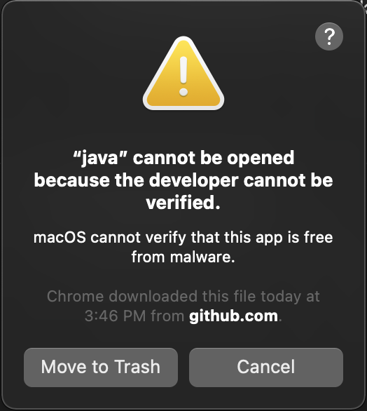
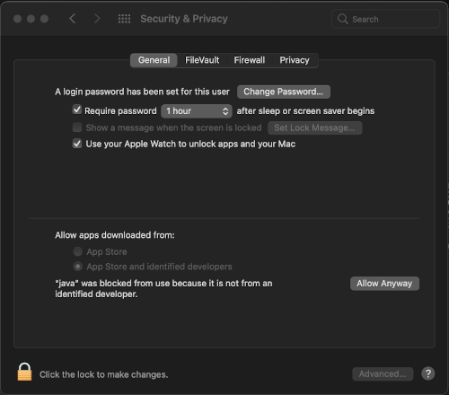
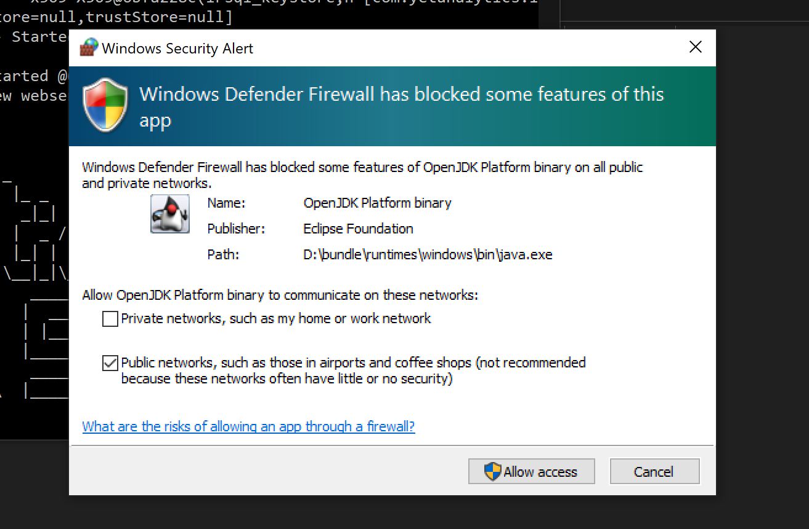
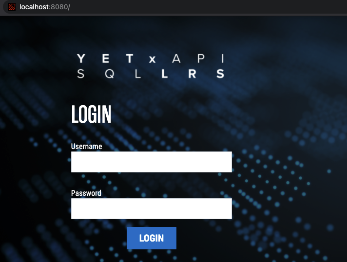

# Getting Started

## Startup instructions

#### 1. Download
- Download and unzip the SQL LRS package and place it in your preferred directory.

#### 2. HTTPS Config
- In order to support HTTPS, SQL LRS creates a temporary self-signed certificate upon startup.
- If you have a valid TLS certificate you would like to use you can find more instructions for installing it [here](https.md).

#### 3. Configuration Variables
Create initial configuration variables. Config vars can be set by creating and editing the file `config/lrsql.json` in your SQL LRS directory, or alternatively as environment variables; to start off with the following should be set:
- `adminUserDefault` and `adminPassDefault` MUST be set in order to create an initial admin account. Otherwise you will not be able to use the LRS. These are temporary credentials we will use to log in the very first time.
- `httpHost` should be set to the domain you are running your webserver on if you are allowing network access (by default it is `0.0.0.0` for localhost); likewise for `httpPort` and `httpsPort` (which by default are `8080` and `8443`, respectively).
- Likewise, `authorityUrl` should be set to a custom domain in order to uniquely identify Statements inserted into your LRS.
- If you are running PostgreSQL, you should set `dbHost`, `dbUser`, and `dbPassword` to the appropriate PostgreSQL system, as well as `dbProperties` if needed.

The `config/lrsql.json` file does not need to contain _all_ config vars; those that are skipped will use their default values.

The following is an example of a basic (non-Postgres) `config/lrsql.json` config file:

```json
{
    "lrs": {
        "adminUserDefault": "DonaldChamberlin44",
        "adminPassDefault": "ILoveSql!",
        "authorityUrl": "http://mydomain.com"
    },
    "webserver": {
        "httpHost": "localhost"
    }
}
```

For a complete list of config variables, see [here](env_vars.md). There is also a sample json config file provided for reference at `config/lrsql.json.example` which contains many more variables than the above.

#### 4. Setup Postgres DB (Optional)
- If using Postgres, setup instructions can be found [here](postgres.md).

#### 5. Start the LRS

The LRS uses a slightly different startup procedure depending on what SQL database you want running underneath it. The following table details those modes of operation.

| Mode | Linux/MacOS Script | Windows | Description |
| --- | --- | --- | --- |
| SQLite | `bin/run_sqlite.sh` | `lrsql.exe` | Run with a SQLite database on the filesystem. This is the typical run mode for an LRS without an external database. |
| Postgres | `bin/run_postgres.sh` | `lrsql_pg.exe` | Run with a separate Postgres Database. You must perform [additional configuration](postgres.md) to use this mode, and have a database already running and accessible by the LRS. |
| H2 In-Memory | `bin/run_h2.sh` | `n/a` | In-memory H2 db mostly used for development. This will not save your data after a restart. There is not a windows executable for this mode. |
| H2 Persistent | `bin/run_h2_persistent.sh` | `n/a` | H2 db mostly used for development. There is not a windows executable for this mode. |


##### Mac or Linux
- In terminal/shell navigate to the root of the SQL LRS directory
- Run the appropriate shell script from the command line, e.g. `bin/run_sqlite.sh`.

##### Windows
- Windows: Double click to run the appropriate executable: e.g. `lrsql.exe`

In either case you should see a command line output resembling the following, which indicates you have started up successfully.


During startup you may see a firewall/security warning depending on OS. In MacOS it may look like the following:



In which case go to your settings and click Allow Anyway on this screen:



In Windows you may see a similar warning that looks like this:



### 6. Create Accounts and Credentials

Now that the LRS is running, let's set up a (non-seed) account and some credentials to use it.

- First navigate in a browser to the LRS address. This will be `http(s)://[host]:[port]/`. For example, if you did not change the host and port variables in the sections above, then by default it should be accessible at `http://localhost:8080/`. You should see a login screen much like the following:



- Log into the LRS Admin UI using your seed admin account username and password that you set in `config/lrsql.json`.

- Under "Account Management," enter a new username and password and click "Create Account."

- Then log back in as the new account.

- Under "Credentials Management", click "Add New Credentials," which will auto-generate a new API key and secret.

### 7. Delete Seed Account
For security purposes, it is important to delete the seed account (as the username and password are stored in plaintext). While logged in as the new account you just created in part 6, go to "Account Management," click the "Delete" button corresponding to the seed account.


Additionally you should remove the `adminUserDefault` and `adminPassDefault` lines from `config/lrsql.json`. This will prevent the system from re-creating the seed accounts on future restarts.

## Your first Statement

xAPI Statements can be inserted into and queried from the SQL LRS using HTTP commands. Let us insert the following Statement:

```json
{
    "actor": {
        "mbox": "mailto:mike@example.org",
        "name": "Mike"
    },
    "verb": {
        "id": "http://example.org/verb/did",
        "display": {"en-US": "Did"}
    },
    "object": {
        "id": "http://example.org/activity/activity-1",
        "definition": {
            "name": {"en-US": "Activity 1"},
            "type": "http://example.org/activity-type/generic-activity"
        }
    }
}
```

In order to insert this Statement into your LRS, run the following command:
```
curl -X POST \
    http://[host]:[port]/xapi/statements \
    -H "Content-Type: application/json" \
    -H "X-Experience-API-Version: 1.0.3" \
    -u "[api-key]:[api-secret]" \
    -d '[statement data]'
```
where `api-key` and `api-secret` are the credential pair you created earlier, `host` and `port` are set for your webserver, and `statement data` is your Statement (which you can copy-paste from above). This should return a json array containing a single UUID; this is the Statement ID that the SQL LRS generated (since the Statement did not have a pre-existing ID).

In order to retrieve that statement, you can run the following command:
```
curl -X GET \
    http://[host]:[port]/xapi/statements \
    -H "Content-Type: application/json" \
    -H "X-Experience-API-Version: 1.0.3" \
    -u "[username]:[password]"
```
This will run a query where all Statements will be returned - in this case, the one Statement we had just inserted.
