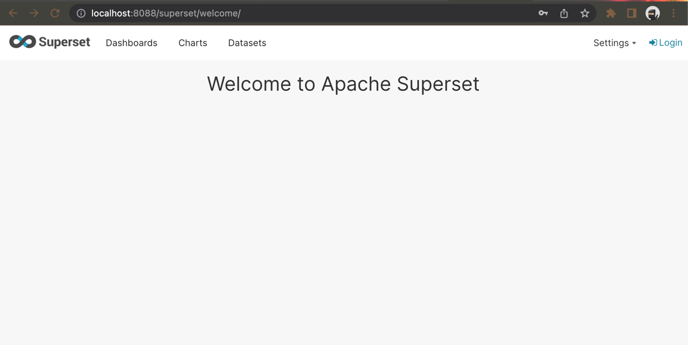
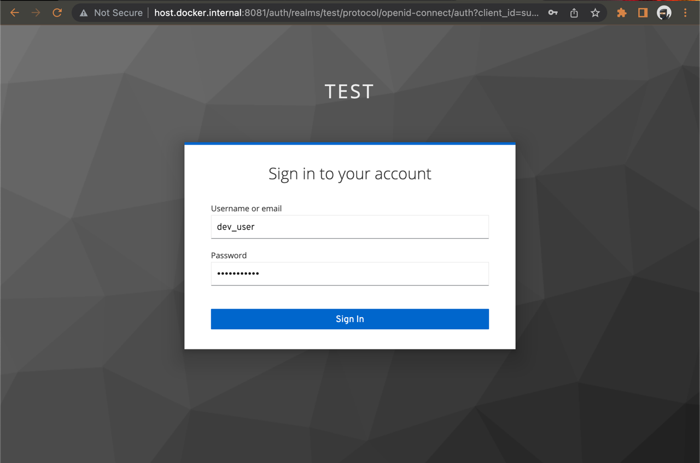
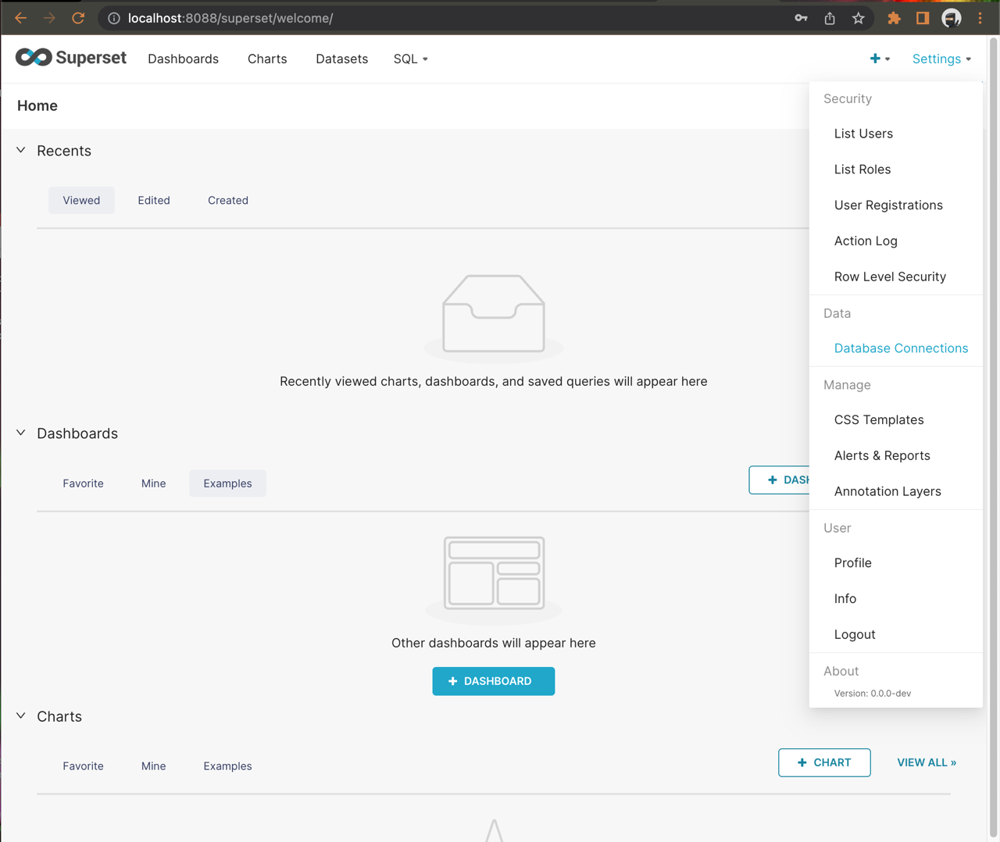
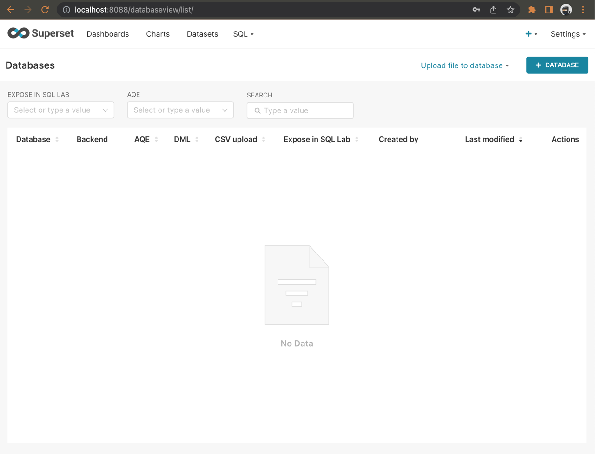
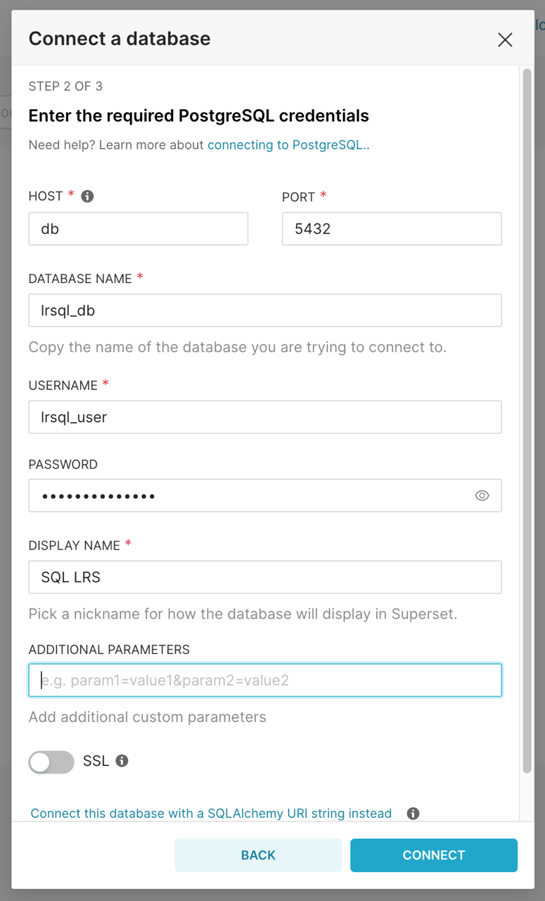
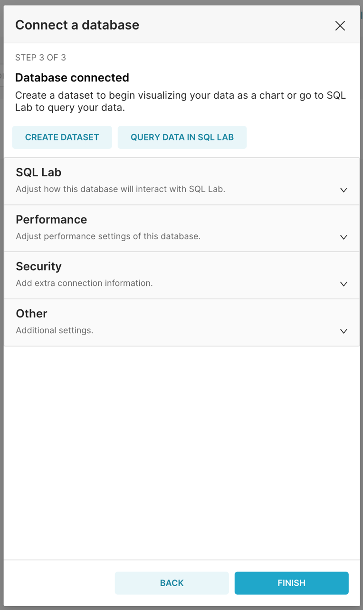
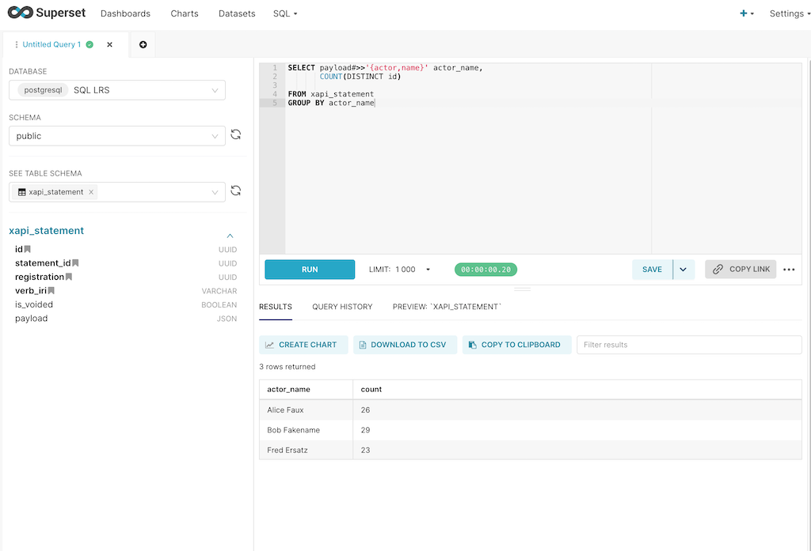
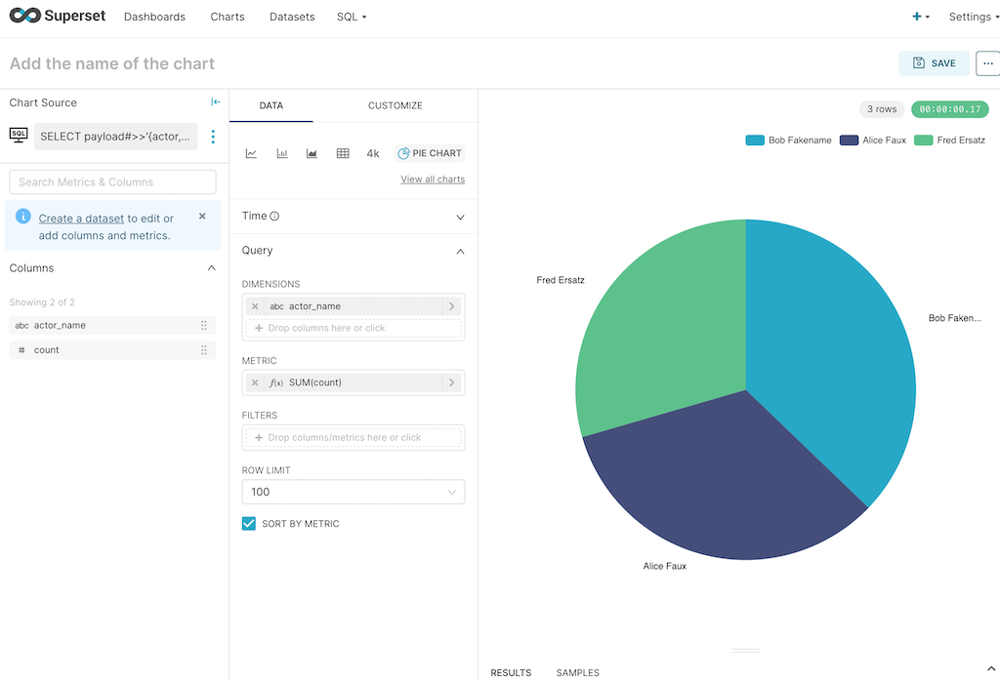

[<- Back to Index](index.md)

# Apache Superset Demo

SQL LRS's Postgresql support enables BI solutions like [Apache Superset](https://superset.apache.org/) to query the underlying SQL database. The SQL LRS project includes a Docker Compose file that can be used to demo this functionality.

### Run the Docker Stack

The Docker Compose stack includes an LRS, Postgresql, Keycloak, Superset and Redis (used as a cache by Superset). A Keycloak instance controls access to both the LRS and Superset.

Note that for Keycloak to work (at least on Docker for Mac) you'll need to map your loopback IP to `host.docker.internal` so that Superset can reach Keycloak at an address that is also available to the host machine. This can be done by adding the following line to your `/etc/hosts` file (note you will need administrative/sudo access):

    127.0.0.1 host.docker.internal

To run the demo:

    cd dev-resources/superset_demo
    docker compose up -d

or

    make superset-demo

Wait a minute or two for everything to start up.

### Add xAPI data

You'll need some data to visualize. Hook up the xAPI-conformant Learning Record Provider (LRP) of your choice or use [DATASIM](https://github.com/yetanalytics/datasim) to simulate learning activity:

``` shell

git clone https://github.com/yetanalytics/datasim.git

cd datasim

docker run -v "$(pwd)"/dev-resources:/dev-resources  \
           -it \
           --rm \
           yetanalytics/datasim:latest \
           -i /dev-resources/input/simple.json \
           -E http://host.docker.internal:8080/xapi \
           -U my_key \
           -P my_secret \
           generate post

```

### Log In to Superset

Navigate to [http://localhost:8088/](http://localhost:8088/):



Click "Login" and log in with the username `dev_user` and the password `changeme123`:



### Add the SQL LRS Postgresql Database

Select "Database Connections" from the righthand menu:



You'll see an empty list of databases. Click "+ Database" on the right:



Select "PostgreSQL" in the list and proceed to the next screen:



Enter the following configuration:

| Field         | Value          | Notes                                                  |
|:--------------|:---------------|:-------------------------------------------------------|
| HOST          | db             | The docker-internal address of the Postgresql database |
| PORT          | 5432           |                                                        |
| DATABASE NAME | lrsql_db       | Specified in the Docker Compose file                   |
| USERNAME      | lrsql_user     | "                                                      |
| PASSWORD      | lrsql_password | "                                                      |
| DISPLAY NAME  | SQL LRS        | Arbitrary name tag                                     |

And click "CONNECT". You should see confirmation that the database is connected:



Click "FINISH" and the database is ready to explore with Superset.

Explore SQL LRS in SQL Lab:



Create a chart:



[<- Back to Index](index.md)
